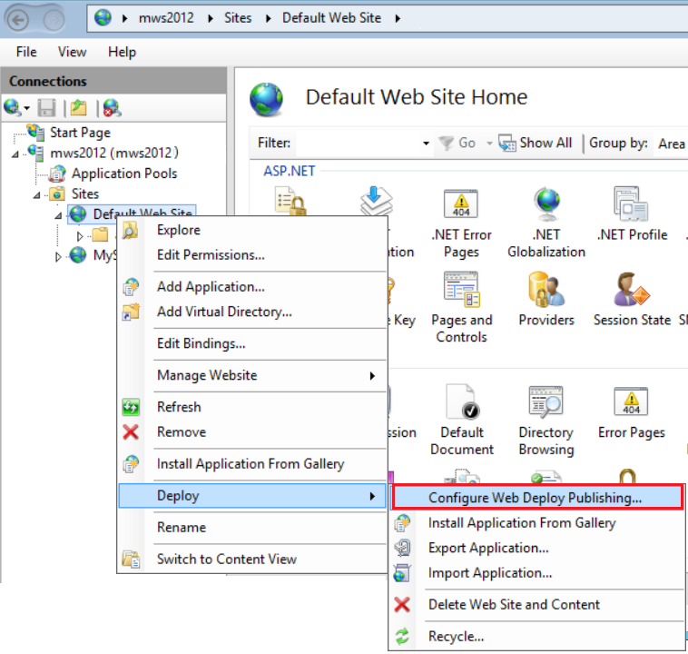

1. Close and reopen the IIS Management Console to show updated configuration options in the UI.

2. In IIS, right-click the **Default Web Site**, choose **Deploy** > **Configure Web Deploy Publishing**.

    

3. In the **Configure Web Deploy Publishing** dialog box, examine the settings.

4. Click **Setup**.

    In the **Results** panel, the output shows that access rights are granted to the specified user, and that a file with a *.publishsettings* file extension has been generated in the location shown in the dialog box.

    ```xml
    <?xml version="1.0" encoding="utf-8"?>
    <publishData>
      <publishProfile
        publishUrl="https://myhostname:8172/msdeploy.axd"
        msdeploySite="Default Web Site"
        destinationAppUrl="http://myhostname:80/"
        mySQLDBConnectionString=""
        SQLServerDBConnectionString=""
        profileName="Default Settings"
        publishMethod="MSDeploy"
        userName="myhostname\myusername" />
    </publishData>
    ```

    Depending on your Windows Server and IIS configuration, you see different values in the XML file. Here are a few details about the values that you see:

   * The *msdeploy.axd* file referenced in the `publishUrl` attribute is a dynamically generated HTTP handler file for Web Deploy. (For testing purposes, `http://myhostname:8172` generally works as well.)
   * The `publishUrl` port is set to port 8172, which is the default for Web Deploy.
   * The `destinationAppUrl` port is set to port 80, which is the default for IIS.
   * If you are unable to connect to the remote host in Visual Studio using the host name (in later steps), test the IP address in place of the host name.

     > [!NOTE]
     > If you are publishing to IIS running on an Azure VM, you must open the Web Deploy and IIS ports in the Network Security group. For detailed information, see [Install and run IIS](/azure/virtual-machines/windows/quick-create-portal#open-port-80-for-web-traffic).

5. Copy this file to the computer where you are running Visual Studio.
