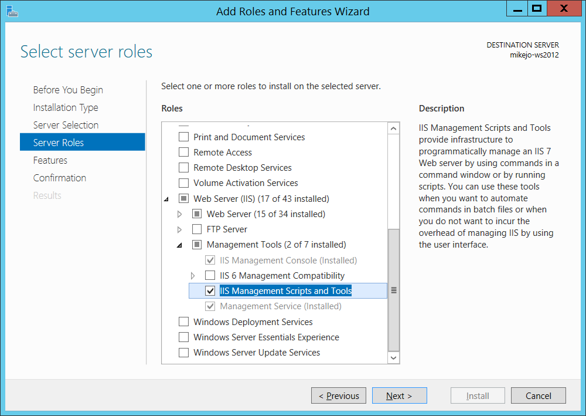

Web Deploy 3.6 for Hosting Servers provides additional configuration features that enable the creation of the publish settings file from the UI.

1. If you have Web Deploy 3.6 already installed on Windows Server, uninstall it using **Control Panel** > **Programs** > **Uninstall a Program**.

2. Next, install Web Deploy 3.6 for Hosting Servers on Windows Server.

    To install Web Deploy for Hosting Servers, use the [Web Platform Installer (WebPI)](https://www.microsoft.com/web/downloads/platform.aspx). (To find the Web Platform Installer link from IIS, select **IIS** in the left pane of Server Manager. Right-click the server and select **Internet Information Services (IIS) Manager**.)

    In the Web Platform Installer, you find **Web Deploy for Hosting Servers** in the Applications tab.

3. If you did not already install **IIS Management Scripts and Tools**, install it now.

    Go to **Select server roles** > **Web Server (IIS)** > **Management Tools**, and then select the **IIS Management Scripts and Tools** role, click **Next**, and then install the role.

    

    The scripts and tools are required to enable the generation of the publish settings file.

4. (Optional) Verify that Web Deploy is running correctly by opening  **Control Panel > System and Security > Administrative Tools > Services** and make sure that **Web Deployment Agent Service** is running (the service name is different in older versions).

    If the agent service is not running, start it. If it is not present at all, go to **Control Panel > Programs > Uninstall a program**, find **Microsoft Web Deploy <version>**. Choose to **Change** the installation and make sure that you choose  **Will be installed to the local hard drive** for the Web Deploy components. Complete the change installation steps.