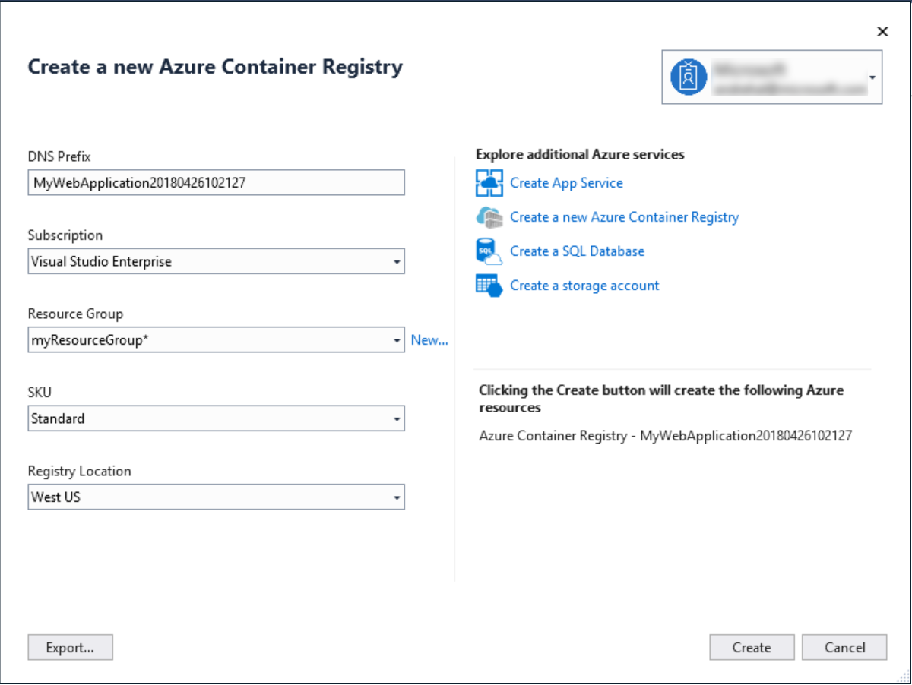

# Deploy an ASP.NET container to a container registry using Visual Studio

## Overview

Docker is a lightweight container engine, similar in some ways to a virtual machine, which you can use to host applications and services.
This tutorial walks you through using Visual Studio to publish your containerized application to an [Azure Container Registry](https://azure.microsoft.com/services/container-registry).

If you don't have an Azure subscription, create a [free account](https://azure.microsoft.com/free/dotnet/?utm_source=acr-publish-doc&utm_medium=docs&utm_campaign=docs) before you begin.

## Prerequisites

To complete this tutorial:

* Install the latest version of [Visual Studio 2017](https://azure.microsoft.com/downloads/) with the "ASP.NET and web development" workload
* Install [Docker for Windows](https://docs.docker.com/docker-for-windows/install/)

## 1. Create an ASP.NET Core web app
The following steps guide you through creating a basic ASP.NET Core app that will be used in this tutorial.

[!INCLUDE [create-aspnet5-app](../azure/includes/create-aspnet5-app.md)]

## 2. Publish your container to Azure Container Registry
1. Right-click your project in **Solution Explorer** and choose **Publish**.
2. On the publish target dialog, select the **Container Registry** tab.
3. Choose **New Azure Container Registry** and click **Publish**.
4. Fill in your desired values in the **Create a new Azure Container Registry**.

    | Setting      | Suggested value  | Description                                |
    | ------------ |  ------- | -------------------------------------------------- |
    | **DNS Prefix** | Globally unique name | Name that uniquely identifies your container registry. |
    | **Subscription** | Choose your subscription | The Azure subscription to use. |
    | **[Resource Group](/azure/azure-resource-manager/resource-group-overview)** | myResourceGroup |  Name of the resource group in which to create your container registry. Choose **New** to create a new resource group.|
    | **[SKU](https://docs.microsoft.com/azure/container-registry/container-registry-skus)** | Standard | Service tier of the container registry  |
    | **Registry Location** | A location close to you | Choose a Location in a [region](https://azure.microsoft.com/regions/) near you or near other services that will use your container registry. |

    

5. Click **Create**

You can now pull the container from the registry to any host capable of running Docker images, for example [Azure Container Instances](/azure/container-instances/container-instances-tutorial-deploy-app).