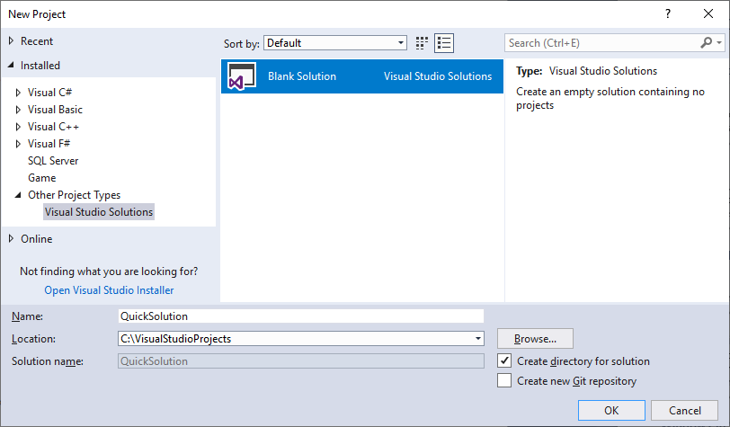
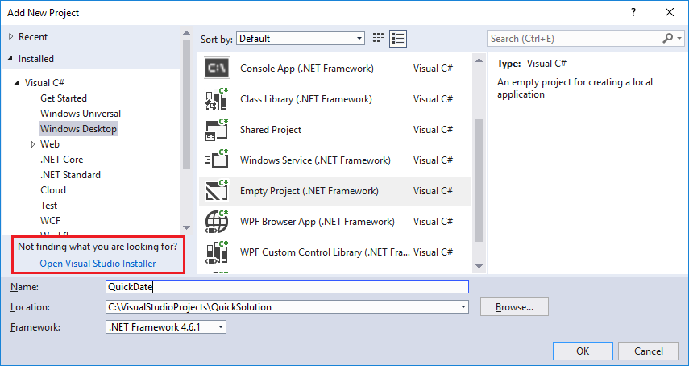
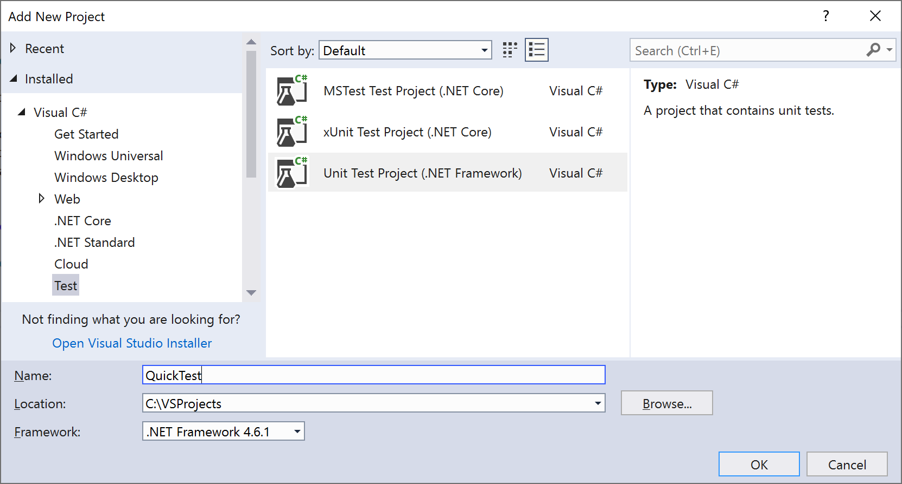
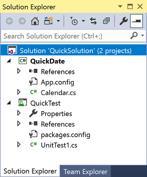
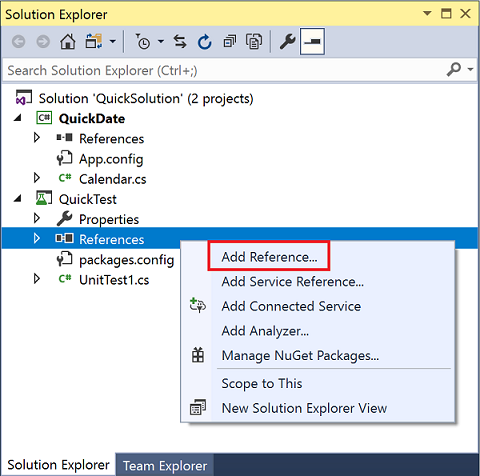
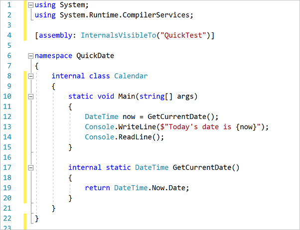
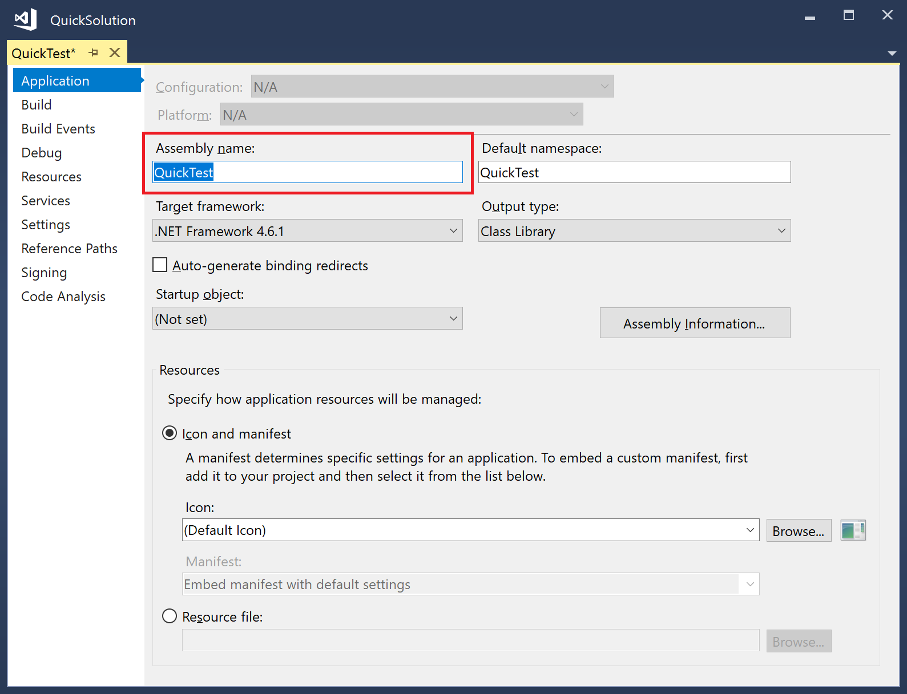
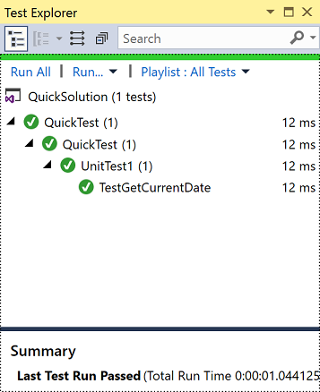

# Learn about projects and solutions using C#

In this introductory article, we'll explore what it means to create a *solution* and a *project* in Visual Studio. A solution is a container that's used to organize one or more related code projects, for example a class library project and a corresponding test project. We'll look at the properties of a project and some of the files it can contain. We'll also create a reference from one project to another.

> [!TIP]
> If you haven't already installed Visual Studio, go to the [Visual Studio downloads](https://visualstudio.microsoft.com/downloads/?utm_medium=microsoft&utm_source=docs.microsoft.com&utm_campaign=button+cta&utm_content=download+vs2017) page to install it for free.

We'll construct a solution and project from scratch as an educational exercise to understand the concept of a project. In your general use of Visual Studio, you'll likely use some of the various project *templates* that Visual Studio offers when you create a new project.

> [!NOTE]
> Solutions and projects aren't required to develop apps in Visual Studio. You can also just open a folder that contains code and start coding, building, and debugging. For example, if you clone a [GitHub](https://github.com/) repo, it might not contain Visual Studio projects and solutions. For more information, see [Develop code in Visual Studio without projects or solutions](../../ide/develop-code-in-visual-studio-without-projects-or-solutions.md).

## Solutions and projects

Despite its name, a solution is not an "answer". A solution is simply a container used by Visual Studio to organize one or more related projects. When you open a solution in Visual Studio, it automatically loads all the projects that the solution contains.

### Create a solution

We'll start our exploration by creating an empty solution. After you get to know Visual Studio, you probably won't find yourself creating empty solutions very often. When you create a new project, Visual Studio automatically creates a solution to house the project if there's not a solution already open.

1. Open Visual Studio.

1. On the menu bar, which is the row of menus such as **File** and **Edit**, choose **File** > **New** > **Project**.

   The **New Project** dialog box opens.

1. In the left pane, expand **Other Project Types**, then choose **Visual Studio Solutions**. In the center pane, choose the **Blank Solution** template. Name your solution **QuickSolution**, then choose the **OK** button.

   

   The **Start Page** closes, and a solution appears in **Solution Explorer** on the right-hand side of the Visual Studio window. You'll probably use **Solution Explorer** often, to browse the contents of your projects.

### Add a project

Now let's add our first project to the solution. We'll start with an empty project and add the items we need to the project.

1. From the right-click or context menu of **Solution 'QuickSolution'** in **Solution Explorer**, choose **Add** > **New Project**.

   The **Add New Project** dialog box opens.

1. In the left pane, expand **Visual C#** and choose **Windows Desktop**. Then, in the middle pane, choose the **Empty Project (.NET Framework)** template. Name the project **QuickDate**, then choose the **OK** button.

   A project named QuickDate appears beneath the solution in **Solution Explorer**. Currently it contains a single file called *App.config*.

   > [!NOTE]
   > If you don't see **Visual C#** in the left pane of the dialog box, you need to install the **.NET desktop development** Visual Studio *workload*. Visual Studio uses workload-based installation to only install the components you need for the type of development you do. An easy way to install a new workload is to choose the **Open Visual Studio Installer** link in the bottom left corner of the **Add New Project** dialog box. After Visual Studio Installer launches, choose the **.NET desktop development** workload and then the **Modify** button.

   

## Add an item to the project

We have an empty project. Let's add a code file.

1. From the right-click or context menu of the **QuickDate** project in **Solution Explorer**, choose **Add** > **New Item**.

   The **Add New Item** dialog box opens.

1. Expand **Visual C# Items**, then choose **Code**. In the middle pane choose the **Class** item template. Name the class **Calendar**, and then choose the **Add** button.

   A file named *Calendar.cs* is added to the project. The *.cs* on the end is the file extension that is given to C# code files. The file appears in the visual project hierarchy in **Solution Explorer**, and its contents are opened in the editor.

1. Replace the contents of the *Calendar.cs* file with the following code:

   ```csharp
   using System;

   namespace QuickDate
   {
       internal class Calendar
       {
           static void Main(string[] args)
           {
               DateTime now = GetCurrentDate();
               Console.WriteLine($"Today's date is {now}");
               Console.ReadLine();
           }

           internal static DateTime GetCurrentDate()
           {
               return DateTime.Now.Date;
           }
       }
   }
   ```

   You don't need to understand what the code does, but if you want, you can run the program by pressing **Ctrl**+**F5** and see that it prints today's date to the console (or standard output) window.

## Add a second project

It is common for solutions to contain more than one project, and often these projects reference each other. Some projects in a solution might be class libraries, some executable applications, and some might be unit test projects or websites.

Let's add a unit test project to our solution. This time we'll start from a project template so we don't have to add an additional code file to the project.

1. From the right-click or context menu of **Solution 'QuickSolution'** in **Solution Explorer**, choose **Add** > **New Project**.

   The **Add New Project** dialog box opens.

1. In the left pane, expand **Visual C#** and choose the **Test** category. In the middle pane, choose the **Unit Test Project (.NET Framework)** project template. Name the project **QuickTest**, and then choose the **OK** button.

   

   A second project is added to **Solution Explorer**, and a file named *UnitTest1.cs* opens in the editor.

   

## Add a project reference

We're going to use the new unit test project to test our method in the **QuickDate** project, so we need to add a reference to that project. This creates a *build dependency* between the two projects, meaning that when you build the solution, **QuickDate** is built before **QuickTest**.

1. Choose the **References** node in the **QuickTest** project, and from the right-click or context menu, choose **Add Reference**.

   

   The **Reference Manager** dialog box opens.

1. In the left pane, expand **Projects** and choose **Solution**. In the middle pane, choose the checkbox next to **QuickDate**, and then choose the **OK** button.

   A reference to the **QuickDate** project is added.

## Add test code

1. Now we'll add test code to the C# test code file. Replace the contents of *UnitTest1.cs* with the following code:

   ```csharp
   using System;
   using Microsoft.VisualStudio.TestTools.UnitTesting;

   namespace QuickTest
   {
       [TestClass]
       public class UnitTest1
       {
           [TestMethod]
           public void TestGetCurrentDate()
           {
               Assert.AreEqual(DateTime.Now.Date, QuickDate.Calendar.GetCurrentDate());
           }
       }
   }
   ```

   You'll see a red "squiggly" under some of the code. We'll fix this error by making the test project a [friend assembly](/dotnet/csharp/programming-guide/concepts/assemblies-gac/friend-assemblies) to the **QuickDate** project.

1. Back in the **QuickDate** project, open the *Calendar.cs* file if it's not already open, and add the following [using statement](/dotnet/csharp/language-reference/keywords/using-statement) and <xref:System.Runtime.CompilerServices.InternalsVisibleToAttribute> attribute to the top of the file, to resolve the error in the test project.

   ```csharp
   using System.Runtime.CompilerServices;

   [assembly: InternalsVisibleTo("QuickTest")]
   ```

   The code file should look like this:

   

## Project properties

The line in the *Calendar.cs* file that contains the <xref:System.Runtime.CompilerServices.InternalsVisibleToAttribute> attribute references the assembly name (file name) of the **QuickTest** project. The assembly name might not always be the same as the project name. To find the assembly name of a project, open the project properties.

1. In **Solution Explorer**, select the **QuickTest** project. From the right-click or context menu, select **Properties**, or just press **Alt**+**Enter**.

   The *property pages* for the project open on the **Application** tab. The property pages contain various settings for the project. Notice that the assembly name of the **QuickTest** project is indeed "QuickTest". If you wanted to change it, this is where you'd do that. Then, when you build the test project, the name of the resulting binary file would change from *QuickTest.dll* to whatever you chose.

   

1. Explore some of the other tabs of the project's property pages, such as **Build** and **Settings**. These tabs are different for different types of projects.

## (Optional) Run the test

If you want to check that your unit test is working, choose **Test** > **Run** > **All Tests** from the menu bar. A window called **Test Explorer** opens, and you should see that the **TestGetCurrentDate** test passes.



> [!TIP]
> If **Test Explorer** doesn't open automatically, open it by choosing **Test** > **Windows** > **Test Explorer** from the menu bar.

## Next steps

If you want to further explore Visual Studio, consider creating an app by following one of the [C# tutorials](index.yml).

## See also

- [Create projects and solutions](../../ide/creating-solutions-and-projects.md)
- [Manage project and solution properties](../../ide/managing-project-and-solution-properties.md)
- [Manage references in a project](../../ide/managing-references-in-a-project.md)
- [Develop code in Visual Studio without projects or solutions](../../ide/develop-code-in-visual-studio-without-projects-or-solutions.md)
- [Visual Studio IDE overview](../../get-started/visual-studio-ide.md)