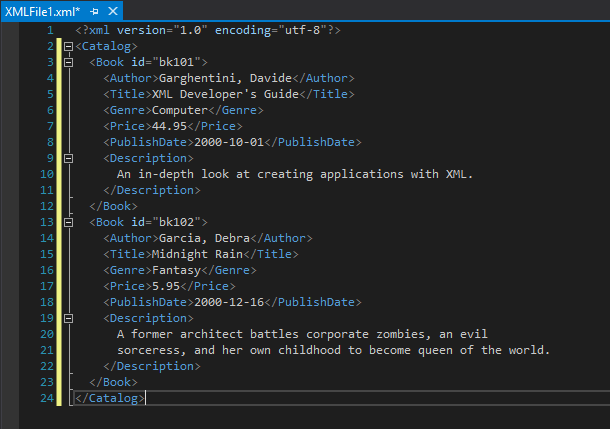
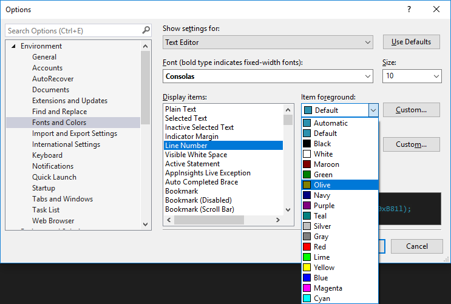
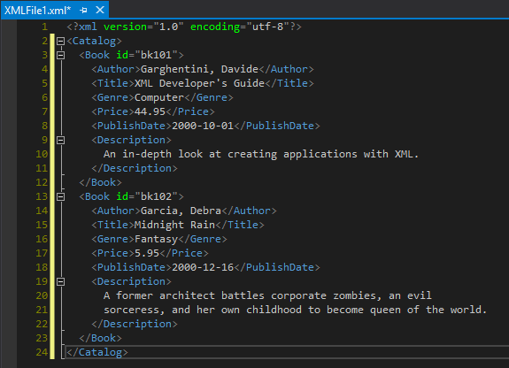

# Quickstart: Personalize the Visual Studio IDE and Editor

In this 5-10 minute quickstart, we'll customize the Visual Studio color theme by selecting the dark theme. We'll also customize the colors for two different types of text in the text editor.

If you haven't already installed Visual Studio, go to the [Visual Studio downloads](https://visualstudio.microsoft.com/downloads/?utm_medium=microsoft&utm_source=docs.microsoft.com&utm_campaign=button+cta&utm_content=download+vs2017) page to install it for free.

## Set the color theme

The default color theme for Visual Studio 2017's user interface is called **Blue**. Let's change it to **Dark**.

1. On the menu bar, which is the row of menus such as **File** and **Edit**, choose **Tools** > **Options**.

1. On the **Environment** > **General** options page, change the **Color theme** selection to **Dark**, and then choose **OK**.

   The color theme for the entire Visual Studio development environment (IDE) is changed to **Dark**.

   

> [!TIP]
> You can install additional predefined themes by installing the **Visual Studio Color Theme Editor** from the [Visual Studio marketplace](https://marketplace.visualstudio.com/items?itemName=VisualStudioPlatformTeam.VisualStudio2017ColorThemeEditor). After you install this tool, additional color themes appear in the **Color theme** drop-down list.

## Change text color

Now we'll customize some text colors for the editor. First, let's create a new XML file to see the default colors.

1. From the menu bar, choose **File** > **New** > **File**.

1. In the **New File** dialog box, under the **General** category, choose **XML File**, and then choose **Open**.

1. Paste the following XML below the line that contains `<?xml version="1.0" encoding="utf-8"?>`.

   ```xml
   <Catalog>
     <Book id="bk101">
     <Author>Garghentini, Davide</Author>
     <Title>XML Developer's Guide</Title>
     <Genre>Computer</Genre>
     <Price>44.95</Price>
     <PublishDate>2000-10-01</PublishDate>
     <Description>
       An in-depth look at creating applications with XML.
     </Description>
   </Book>
   <Book id="bk102">
     <Author>Garcia, Debra</Author>
     <Title>Midnight Rain</Title>
     <Genre>Fantasy</Genre>
     <Price>5.95</Price>
     <PublishDate>2000-12-16</PublishDate>
     <Description>
       A former architect battles corporate zombies, an evil
       sorceress, and her own childhood to become queen of the world.
     </Description>
   </Book>
   </Catalog>
   ```

   Notice that the line numbers are a turquoise-blue color, and the XML attributes (such as `id="bk101"`) are a light blue color. We're going to change the text color for these items.

   

1. To open the **Options** dialog box, choose **Tools** > **Options** from the menu bar.

1. Under **Environment**, choose the **Fonts and Colors** category.

   Notice that the text under **Show settings for** says **Text Editor**&mdash;this is what we want. Expand the drop-down list just to see the extensive list of places where you can customize fonts and text color.

1. To change the color of the line numbers text, in the **Display items** list, choose **Line Number**. In the **Item foreground** box, choose **Olive**.

   

   Some languages have their own specific fonts and colors settings. If you are a C++ developer and you want to change the color used for functions, for example, you can look for **C++ Functions** in the **Display items** list.

1. Before we exit out of the dialog box, let's also change the color of XML attributes. In the **Display items** list, scroll down to **XML Attribute** and select it. In the **Item foreground** box, choose **Lime**. Choose **OK** to save our selections and close the dialog box.

   The line numbers are now an olive color, and the XML attributes are a bright, lime green. If you open another file type, such as a C++ or C# code file, you'll see that the line numbers also appear in the olive color.

   

We explored just a couple ways of customizing the colors in Visual Studio. We hope that you'll explore the other customization options in the **Options** dialog box, to truly make Visual Studio your own.

## See also

- [Customize the editor](../ide/customizing-the-editor.md)
- [Visual Studio IDE Overview](../get-started/visual-studio-ide.md)