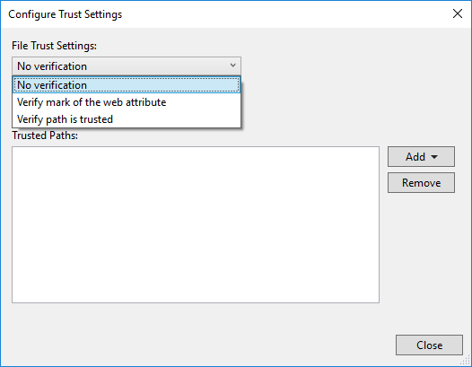
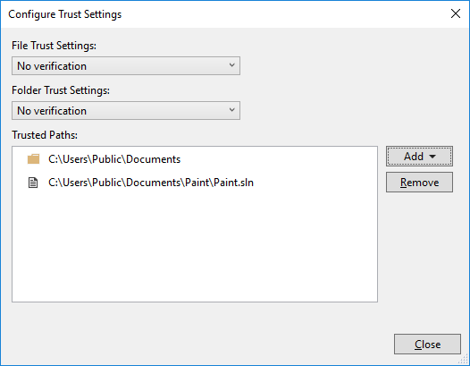

# Configure trust settings for files and folders

Visual Studio prompts for user approval before opening projects that have the [mark of the web](/previous-versions/windows/internet-explorer/ie-developer/compatibility/ms537628(v=vs.85)). For added security, you can also configure Visual Studio to prompt for user approval before opening any file or folder that has the mark of the web attribute, or that isn't designated as *trusted*. File and folder checks are disabled by default.

> [!WARNING]
> You should still ensure that the file, folder, or solution comes from a trusted person or a trusted location before approving it.

## Configure trust settings

To change trust settings, follow these steps:

1. Open **Tools** > **Options** > **Trust Settings** and select the **Configure Trust Settings** link in the right-hand pane.

2. Choose the level of checks you'd like for files and folders. You can have different checks for each one. The options are:

   * **No verification**: Visual Studio doesn't perform any checks.

   * **Verify mark of the web attribute**: If the file or folder has the mark of the web attribute, Visual Studio blocks and asks for permission to open.

   * **Verify path is trusted**: If the file or folder path isn't part of the **Trusted Paths** list, Visual Studio blocks and asks for permission to open.

   

## Add trusted paths

To add trusted paths, follow these steps:

1. Open **Tools** > **Options** > **Trust Settings** and select the **Configure Trust Settings** link in the right-hand pane.

2. Click **Add** in the **Trust Settings** dialog, and then select **File** or **Folder**.

3. Navigate to and select the file or folder you want to add to the trusted list.

   The file or folder path appears in the **Trusted Paths** list.

   

## Remove trusted paths

To remove trusted paths, follow these steps:

1. Open **Tools** > **Options** > **Trust Settings** and select the **Configure Trust Settings** link in the right-hand pane.

2. Select the path you'd like to remove in the **Trusted Paths** list, and then click **Remove**.

   > [!TIP]
   > To select multiple entries, hold down **Shift** while you select the paths.

   The selected paths are removed from the **Trusted Paths** list.
