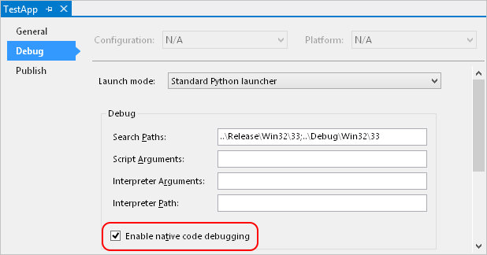
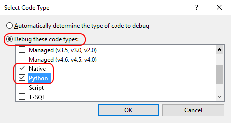
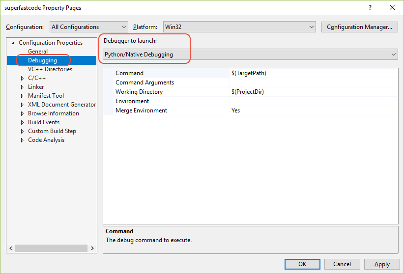
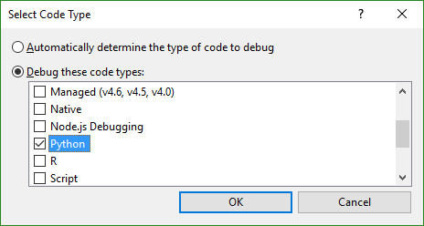
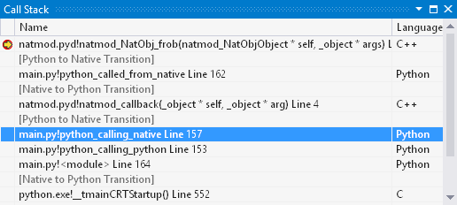
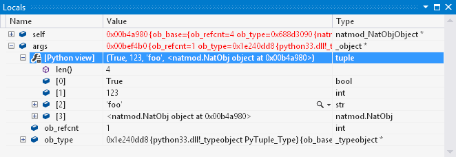
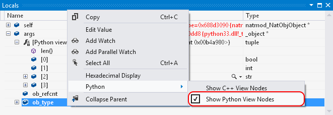
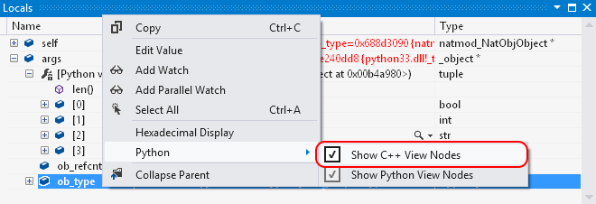
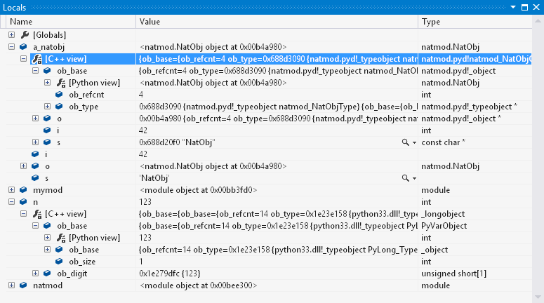

# Debug Python and C++ together

Most regular Python debuggers support debugging of only Python code. In practice, however, Python is used in conjunction with C or C++ in scenarios requiring high performance or the ability to directly invoke platform APIs. (See [Create a C++ extension for Python](working-with-c-cpp-python-in-visual-studio.md) for a walkthrough.)

Visual Studio provides integrated, simultaneous mixed-mode debugging for Python and native C/C++, provided that you select the **Python native development tools** option for the **Python Development** workload in the Visual Studio installer.

> [!Note]
> Mixed-mode debugging is not available with Python Tools for Visual Studio 1.x in Visual Studio 2015 and earlier.

Mixed-mode debugging features include the following, as explained in this article:

- Combined call stacks
- Step between Python and native code
- Breakpoints in both types of code
- See Python representations of objects in native frames and vice versa
- Debugging within the context of the Python project or the C++ project


|   |   |
|---|---|
|  | For an introduction to building, testing, and debugging native C modules with Visual Studio, see [Deep Dive: Create Native Modules](https://youtu.be/D9RlT06a1EI) (youtube.com, 9m 09s). The video is applicable to both Visual Studio 2015 and 2017. |

## Enable mixed-mode debugging in a Python project

1. Right-click the Python project in **Solution Explorer**, select **Properties**, select the **Debug** tab, and then select **Enable native code debugging**. This option enables mixed-mode for all debugging sessions.

    

    > [!Tip]
    > When you enable native code debugging, the Python output window may disappear immediately when the program has completed without giving you the usual **Press any key to continue** pause. To force a pause, add the `-i` option to the **Run** > **Interpreter Arguments** field on the **Debug** tab when you enable native code debugging. This argument puts the Python interpreter into interactive mode after the code finishes, at which point it waits for you to press **Ctrl**+**Z** > **Enter** to exit.

1. When attaching the mixed-mode debugger to an existing process (**Debug** > **Attach to Process**), use the **Select** button to open the **Select Code Type** dialog. Then set the **Debug these code types** option and select both **Native** and **Python** in the list:

    

    The code type settings are persistent, so if you want to disable mixed-mode debugging when attaching to a different process later, clear the **Python** code type.

    It's possible to select other code types in addition to, or instead of, **Native**. For example, if a managed application hosts CPython, which in turn uses native extension modules, and you want to debug all three, you can check **Python**, **Native**, and **Managed** together for a unified debugging experience including combined call stacks and stepping between all three runtimes.

1. When you start debugging in mixed mode for the first time, you may see a **Python Symbols Required** dialog (see [Symbols for mixed-mode debugging](debugging-symbols-for-mixed-mode-c-cpp-python.md)). You need to install symbols only once for any given Python environment. Symbols are automatically included if you install Python support through the Visual Studio 2017 installer.

1. To make the source code for standard Python itself available when debugging, visit [https://www.python.org/downloads/source/](https://www.python.org/downloads/source/), download the archive appropriate for your version, and extract it to a folder. You then point Visual Studio to specific files in that folder at whatever point it prompts you.

## Enable mixed-mode debugging in a C/C++ project

Visual Studio 2017 (version 15.5 and higher) supports mixed-mode debugging from a C/C++ project (for example, when [embedding Python in another application as described on python.org](https://docs.python.org/3/extending/embedding.html)). To enable mixed-mode debugging, configure the C/C++ project to launch **Python/Native Debugging**:

1. Right-click the C/C++ project in **Solution Explorer** and select **Properties**.
1. Select the **Debugging** tab, select **Python/Native Debugging** from the **Debugger to launch**, and select **OK**.

    

Using this method, be aware that you can't debug the *py.exe* launcher itself, because it spawns a child *python.exe* process that the debugger won't be attached to. If you want to launch *python.exe* directly with arguments, change the **Command** option in the **Python/Native Debugging** properties (shown in the previous image) to specify the full path to *python.exe*, then specify arguments in **Command Arguments**.

### Attaching the mixed-mode debugger

For all previous versions of Visual Studio, direct mixed-mode debugging is enabled only when launching a Python project in Visual Studio because C/C++ projects use only the native debugger. You can, however, attach the debugger separately:

1. Start the C++ project without debugging (**Debug** > **Start without Debugging** or **Ctrl**+**F5**).
1. Select **Debug** > **Attach to Process**. In the dialog that appears, select the appropriate process, then use the **Select** button to open the **Select Code Type** dialog in which you can select **Python**:

    

1. Select **OK** to close that dialog, then **Attach** to start the debugger.
1. You may need to introduce a suitable pause or delay in the C++ app to ensure that it doesn't call the Python code you want to debug before you have a chance to attach the debugger.

## Mixed-mode specific features

- [Combined call stack](#combined-call-stack)
- [Step between Python and native code](#step-between-python-and-native-code)
- [PyObject values view in native code](#pyobject-values-view-in-native-code)
- [Native values view in Python code](#native-values-view-in-python-code)

### Combined call stack

The **Call Stack** window shows both native and Python stack frames interleaved, with transitions marked between the two:



Transitions appear as **[External Code]**, without specifying the direction of transition, if the **Tools** > **Options** > **Debugging** > **General** > **Enable Just My Code** option is set.

Double-clicking any call frame makes it active and opens the appropriate source code, if possible. If source code is not available, the frame is still made active and local variables can be inspected.

### Step between Python and native code

When using the **Step Into** (**F11**) or **Step Out** (**Shift**+**F11**) commands, the mixed-mode debugger correctly handles changes between code types. For example, when Python calls a method of a type that is implemented in C, stepping in on a call to that method stops at the beginning of the native function implementing the method. Similarly, when native code calls some Python API function that results in Python code being invoked. For example, stepping into a `PyObject_CallObject` on a function value that was originally defined in Python stops at the beginning of the Python function. Stepping in from Python to native is also supported for native functions invoked from Python via [ctypes](https://docs.python.org/3/library/ctypes.html).

### PyObject values view in native code

When a native (C or C++) frame is active, its local variables show up in the debugger **Locals** window. In native Python extension modules, many of these variables are of type `PyObject` (which is a typedef for `_object`), or a few other fundamental Python types (see list below). In mixed-mode debugging, these values present an additional child node labeled **[Python view]**. When expanded, this node shows the variable's Python representation, identical to what you'd see if a local variable referencing the same object was present in a Python frame. The children of this node are editable.



To disable this feature, right-click anywhere in the **Locals** window and toggle the **Python** > **Show Python View Nodes** menu option:



C types that show **[Python view]** nodes (if enabled):

- `PyObject`
- `PyVarObject`
- `PyTypeObject`
- `PyByteArrayObject`
- `PyBytesObject`
- `PyTupleObject`
- `PyListObject`
- `PyDictObject`
- `PySetObject`
- `PyIntObject`
- `PyLongObject`
- `PyFloatObject`
- `PyStringObject`
- `PyUnicodeObject`

**[Python view]** does not automatically appear for types you author yourself. When authoring extensions for Python 3.x, this lack is usually not an issue because any object ultimately has an `ob_base` field of one of the types above, which causes **[Python view]** to appear.

For Python 2.x, however, each object type typically declares its header as a collection of inline fields, and there is no association between custom authored types and `PyObject` at the type system level in C/C++ code. To enable **[Python view]** nodes for such custom types, edit the *PythonDkm.natvis* file in the [Python tools install directory](installing-python-support-in-visual-studio.md#install-locations), and add another element in the XML for your C struct or C++ class.

An alternate (and better) option is to follow [PEP 3123](https://www.python.org/dev/peps/pep-3123/) and use an explicit `PyObject ob_base;` field rather than `PyObject_HEAD`, though that may not always be possible for backwards-compatibility reasons.

### Native values view in Python code

Similar to the previous section, you can enable a **[C++ view]** for native values in the **Locals** window when a Python frame is active. This feature is not enabled by default, so you turn it on by right-clicking in the **Locals** window and toggling the **Python** > **Show C++ View Nodes** menu option.



The **[C++ view]** node provides a representation of the underlying C/C++ structure for a value, identical to what you'd see in a native frame. For example, it shows an instance of `_longobject` (for which `PyLongObject` is a typedef) for a Python long integer, and it tries to infer types for native classes that you have authored yourself. The children of this node are editable.



If a child field of an object is of type `PyObject`, or one of the other supported types, then it has a **[Python view]** representation node (if those representations are enabled), making it possible to navigate object graphs where links are not directly exposed to Python.

Unlike **[Python view]** nodes, which use Python object metadata to determine the type of the object, there's no similarly reliable mechanism for **[C++ view]**. Generally speaking, given a Python value (that is, a `PyObject` reference) it's not possible to reliably determine which C/C++ structure is backing it. The mixed-mode debugger tries to guess that type by looking at various fields of the object's type (such as the `PyTypeObject` referenced by its `ob_type` field) that have function pointer types. If one of those function pointers references a function that can be resolved, and that function has a `self` parameter with type more specific than `PyObject*`, then that type is assumed to be the backing type. For example, if `ob_type->tp_init` of a given object points at the following function:

```c
static int FobObject_init(FobObject* self, PyObject* args, PyObject* kwds) {
    return 0;
}
```

then the debugger can correctly deduce that the C type of the object is `FobObject`. If it's unable to determine a more precise type from `tp_init`, it moves on to other fields. If it's unable to deduce the type from any of those fields, the **[C++ view]** node presents the object as a `PyObject` instance.

To always get a useful representation for custom authored types, it's best to register at least one special function when registering the type, and use a strongly-typed `self` parameter. Most types fulfill that requirement naturally; if that's not the case, then `tp_init` is usually the most convenient entry to use for this purpose. A dummy implementation of `tp_init` for a type that is present solely to enable debugger type inference can just return zero immediately, as in the code sample above.

## Differences from standard Python debugging

The mixed-mode debugger is distinct from the [standard Python debugger](debugging-python-in-visual-studio.md) in that it introduces some additional features but lacks some Python-related capabilities:

- Unsupported features: conditional breakpoints, **Debug Interactive** window, and cross-platform remote debugging.
- **Immediate** window: is available but with a limited subset of its functionality, including all the limitations listed here.
- Supported Python versions: CPython 2.7 and 3.3+ only.
- Visual Studio Shell: When using Python with Visual Studio Shell (for example, if you installed it using the integrated installer), Visual Studio is unable to open C++ projects, and the editing experience for C++ files is that of a basic text editor only. However, C/C++ debugging and mixed-mode debugging are fully supported in Shell with source code, stepping into native code, and C++ expression evaluation in debugger windows.
- Viewing and expanding objects: When viewing Python objects in the **Locals** and **Watch** debugger tool windows, the mixed-mode debugger shows only the structure of the objects. It does not automatically evaluate properties, or show computed attributes. For collections, it shows only elements for built-in collection types (`tuple`, `list`, `dict`, `set`). Custom collection types are not visualized as collections, unless they are inherited from some built-in collection type.
- Expression evaluation: see below.

### Expression evaluation

The standard Python debugger allows evaluation of arbitrary Python expressions in **Watch** and **Immediate** windows when the debugged process is paused at any point in the code, so long as it is not blocked in an I/O operation or other similar system call. In mixed-mode debugging, arbitrary expressions can be evaluated only when stopped in Python code, after a breakpoint, or when stepping into the code. Expressions can be evaluated only on the thread on which the breakpoint or the stepping operation occurred.

When stopped in native code, or in Python code where the conditions above do not apply (for example, after a step-out operation, or on a different thread), expression evaluation is limited to accessing local and global variables in scope of the currently selected frame, accessing their fields, and indexing built-in collection types with literals. For example, the following expression can be evaluated in any context (provided that all identifiers refer to existing variables and fields of appropriate types):

```python
foo.bar[0].baz['key']
```

The mixed-mode debugger also resolves such expressions differently. All member-access operations look up only fields that are directly part of the object (such as an entry in its `__dict__` or `__slots__`, or a field of a native struct that is exposed to Python via `tp_members`), and ignore any `__getattr__`, `__getattribute__` or descriptor logic. Similarly, all indexing operations ignore `__getitem__`, and access the inner data structures of collections directly.

For the sake of consistency, this name resolution scheme is used for all expressions that match the constraints for limited expression evaluation, regardless of whether arbitrary expressions are allowed at the current stop point. To force proper Python semantics when a full-featured evaluator is available, enclose the expression in parentheses:

```python
(foo.bar[0].baz['key'])
```
