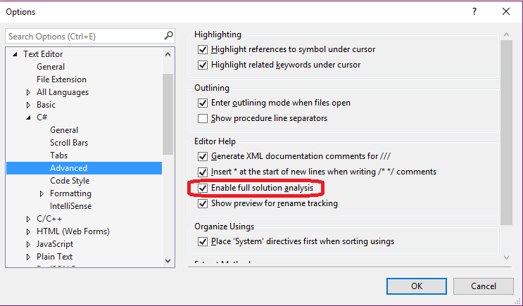

# How to: Enable and Disable Full Solution Analysis for Managed Code
[!INCLUDE[vs2017banner](../includes/vs2017banner.md)]

NOTE]
>  This topic applies only to Visual Studio 2015 Update 3 RC and later.  
  
 *Full solution analysis* is a Visual Studio feature that enables you to choose whether you see code analysis issues only in open Visual C# or Visual Basic files in your solution, or in both open and closed Visual C# or Visual Basic files in your solution.  
  
 While being able to see all issues in all files is useful, it can be distracting and even slow down Visual Studio if your solution is very large or  has a lot of files.  To limit the number of issues shown and improve Visual Studio performance, you can disable full solution analysis. You can easily reenable this feature if you want.  
  
#### To toggle full solution analysis  
  
1.  On the main menu in Visual Studio, choose **Tools** &#124; **Options** to view the **Options** dialog box.  
  
2.  In the **Options** dialog box, choose **Text Editor** &#124; **C#** or **Basic** &#124; **Advanced**.  
  
3.  Select the **Enable full solution analysis** check box to enable full solution analysis, or clear the box to disable it. Choose the **OK** button when you're done.  
  
       
  
## Results of enabling and disabling full solution analysis  
 In the following screenshot, you can see the results when full solution analysis is enabled. All errors and code analysis issues in *all* of the files in the solution appear, regardless of whether the files are open or not.  
  
   
  
 The following screenshot shows the results from the same solution after disabling full solution analysis. Only errors and code analysis issues in open solution files appear in the Error List.  
  
   
  
## Automatically disabling full solution analysis  
 If Visual Studio detects that 200MB or less of system memory is available to it, it automatically disables full solution analysis (as well as some other features) if it's enabled. If this occurs, an alert appears informing you of this. A button lets you re-enable full solution analysis if you want to do so.  
  
   
  
## Additional details  
 By default, full solution analysis is enabled for Visual Basic and disabled for Visual C#.  
  
 Visual Studio Update 3 RC includes an enhanced code analyzer diagnostic v2 engine that significantly reduces memory usage and decreases CPU time to idle, even if full solution analysis is enabled.
