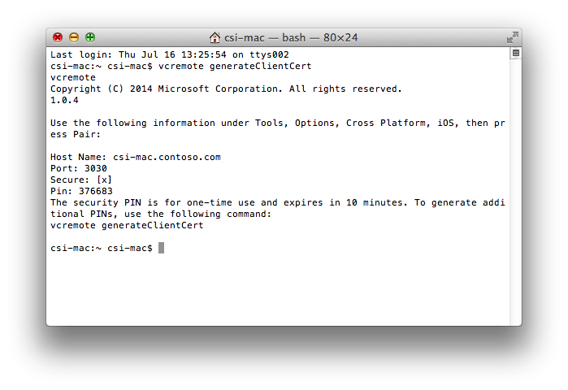
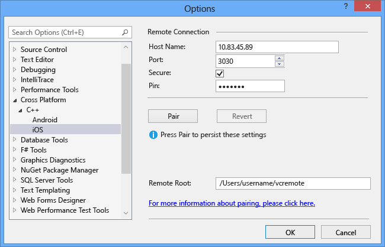

# Install And Configure Tools to Build using iOS
[!INCLUDE[vs2017banner](../includes/vs2017banner.md)]

  
You can use Visual C++ for Cross-Platform Mobile Development to edit, debug and deploy iOS code to the iOS Simulator or to an iOS device, but because of licensing restrictions, the code must be built and run remotely on a Mac. To build and run iOS apps using Visual Studio, you need to set up and configure the remote agent, [vcremote](http://go.microsoft.com/fwlink/p/?LinkId=534988), on your Mac. The remote agent handles build requests from Visual Studio and runs the app on an iOS device connected to the Mac, or in the iOS Simulator on the Mac.  
  
> [!NOTE]
>  For information on using cloud-hosted Mac services instead of a Mac, see [Build and Simulate iOS in the Cloud](https://taco.visualstudio.com/docs/build_ios_cloud/). The instructions are for building using Visual Studio Tools for Apache Cordova. To use the instructions to build using Visual C++ for Cross-Platform Mobile Development, substitute vcremote for vs-mda-remote.  
  
 Once you have installed the tools to build using iOS, refer to this topic for ways to quickly configure and update the remote agent for iOS development in Visual Studio and on your Mac.  
  
 [Prerequisites](#Prerequisites)  
  
 [Install the remote agent for iOS](#Install)  
  
 [Start the remote agent](#Start)  
  
 [Configure the remote agent in Visual Studio](#ConfigureVS)  
  
 [Generate a new security PIN](#GeneratePIN)  
  
 [Generate a new server certificate](#GenerateCert)  
  
 [Configure the remote agent on the Mac](#ConfigureMac)  
  
##   Prerequisites  
 To install and use the remote agent to develop code for iOS, you must first have these prerequisites:  
  
-   A Mac computer running OS X Mavericks or later  
  
-   An [Apple ID](https://appleid.apple.com/)  
  
-   An active [iOS Developer Program](https://developer.apple.com/programs/ios/) account with Apple  
  
-   [Xcode 6](https://developer.apple.com/xcode/downloads/)  
  
     Xcode 6 can be downloaded from the App Store.  
  
-   Xcode command line tools  
  
     To install the Xcode command line tools, open the Terminal app on your Mac and enter the following command:  
  
     `xcode-select --install`  
  
-   An iOS signing identity configured in Xcode  
  
     For detailed information on obtaining an iOS Signing Identity, see [Maintaining Your Signing Identities and Certificates](https://developer.apple.com/library/ios/documentation/IDEs/Conceptual/AppDistributionGuide/MaintainingCertificates/MaintainingCertificates.html) in the iOS Developer Library. To see or set your signing identity in Xcode, open the **Xcode** menu and choose **Preferences**. Select **Accounts** and choose your Apple ID, and then choose the **View Details** button.  
  
-   If you are using an iOS device for development, a Provisioning Profile configured in Xcode for your device  
  
     For detailed information on creating provisioning Profiles, see [Creating Provisioning Profiles Using Member Center](https://developer.apple.com/library/ios/documentation/IDEs/Conceptual/AppDistributionGuide/MaintainingProfiles/MaintainingProfiles.html#//apple_ref/doc/uid/TP40012582-CH30-SW24) in the iOS Developer Library.  
  
-   [Node.js](http://nodejs.org/)  
  
-   An updated version of npm  
  
     The version of npm that comes with Node.js may not be recent enough to install vcremote. To update npm, open the Terminal app on your Mac and enter the following command:  
  
     `sudo npm install -g npm@latest`  
  
##   Install the remote agent for iOS  
 When you install Visual C++ for Cross-Platform Mobile Development, Visual Studio can communicate with [vcremote](http://go.microsoft.com/fwlink/p/?LinkId=534988), a remote agent running on your Mac to transfer files, build and run your iOS app, and send debugging commands.  
  
 Before you install the remote agent, make sure you have satisfied the [Prerequisites](#Prerequisites) and installed [Visual C++ for Cross-Platform Mobile Development](../cross-platform/install-visual-cpp-for-cross-platform-mobile-development.md#InstallTheTools).  
  
###   To download and install the remote agent  
  
- From the Terminal app on your Mac, enter:  
  
   `sudo npm install -g --unsafe-perm vcremote`  
  
   The global installation (**-g**) switch is recommended but not required.  
  
   During the installation, vcremote is installed and developer mode is activated on your Mac. [Homebrew](http://brew.sh/) and two npm packages, vcremote-lib and vcremote-utils, are also installed.  
  
  > [!NOTE]
  >  To install Homebrew, you must have sudo (administrator) access. If you need to install vcremote without sudo, you can install Homebrew manually in a usr/local location and add its bin folder to your path. For more information, see the [Homebrew documentation](https://github.com/Homebrew/homebrew/wiki/Installation). To manually enable developer mode, enter this command in the Terminal app: `DevToolsSecurity –enable`  
  
  If you update to a new version of Visual Studio, you must update to the current version of the remote agent as well. To update the remote agent, repeat the steps to download and install the remote agent.  
  
##   Start the remote agent  
 The remote agent must be running for Visual Studio to build and run your iOS code. Visual Studio must be paired with the remote agent before it can communicate. By default, the remote agent runs in secured connection mode, which requires a PIN to pair with Visual Studio.  
  
###   To start the remote agent  
  
- From the Terminal app on your Mac, enter:  
  
   `vcremote`  
  
   This starts the remote agent with a default build directory of ~/vcremote. For additional configuration options, see [Configure the remote agent on the Mac](#ConfigureMac).  
  
  The first time you start the agent, and any time you create a new client certificate, you are provided with the required information to configure the agent in Visual Studio, including the host name, the port, and the PIN.  
  
    
  
  If you intend to configure the remote agent in Visual Studio using the host name, ping the Mac from Windows using the host name to verify that it is reachable. Otherwise, you may need to use the IP address instead.  
  
  The generated PIN is for one time use, and is only valid for a limited time. If you do not pair Visual Studio with the remote agent before the time expires, you will need to generate a new PIN. For more information, see [Generate a new security PIN](#GeneratePIN).  
  
  You can use the remote agent in unsecured mode. In unsecured mode, the remote agent can be paired to Visual Studio without a PIN.  
  
#### To disable secured connection mode  
  
-   To disable secured connection mode in vcremote, enter this command in the Terminal app on your Mac:  
  
     `vcremote --secure false`  
  
#### To enable secured connection mode  
  
- To enable secured connection mode, enter this command:  
  
   `vcremote --secure true`  
  
  Once you have started the remote agent, you can use it from Visual Studio until you stop it.  
  
#### To stop the remote agent  
  
-   In the Terminal window vcremote is running in, enter `Control+C`.  
  
##   Configure the remote agent in Visual Studio  
 To connect to the remote agent from Visual Studio, you must specify the remote configuration in the Visual Studio options.  
  
#### To configure the remote agent from Visual Studio  
  
1. If the agent is not already running on your Mac, follow the steps in [Start the remote agent](#Start). Your Mac must be running vcremote for Visual Studio to successfully pair, connect and build your project.  
  
2. On your Mac, get the host name or IP address of your Mac.  
  
    You can get the IP address by using the **ifconfig** command in a Terminal window. Use the inet address listed under the active network interface.  
  
3. On the Visual Studio menu bar, choose **Tools**, **Options**.  
  
4. In the **Options** dialog box, expand **Cross Platform**, **C++**, **iOS**.  
  
5. In the **Host Name** and **Port** fields, enter the values specified by the remote agent when you started it. The host name can be the DNS name or IP address of your Mac. The default port is 3030.  
  
   > [!NOTE]
   >  If you cannot ping the Mac using the host name, you may need to use the IP address.  
  
6. If you use the remote agent in the default secured connection mode, check the **Secure** checkbox, then enter the PIN value specified by the remote agent in the **Pin** field. If you use the remote agent in unsecured connection mode, clear the **Secure** checkbox and leave the **Pin** field blank.  
  
7. Choose **Pair** to enable the pairing.  
  
      
  
    The pairing persists until you change the host name or port. If you change the host name or port in the **Options** dialog box, to undo the change, choose the **Revert** button to revert to the previous pairing.  
  
    If the pairing does not succeed, verify that the remote agent is running by following the steps in [Start the remote agent](#Start). If too much time has passed since the remote agent PIN was generated, follow the steps in [Generate a new security PIN](#GeneratePIN) on the Mac and then try again. If you are using the host name of your Mac, try using the IP address in the **Host Name** field instead.  
  
8. Update the folder name in the **Remote Root** field to specify the folder used by the remote agent in your home (~) directory on the Mac. By default, the remote agent uses /Users/`username`/vcremote as the remote root.  
  
9. Choose **OK** to save the remote pairing connection settings.  
  
   Visual Studio uses the same information to connect to the remote agent on your Mac each time you use it. You do not need to pair Visual Studio with the remote agent again unless you generate a new security certificate on your Mac, or its hostname or IP address changes.  
  
##   Generate a new security PIN  
 When you start the remote agent the first time, the generated PIN is valid for a limited amount of time—by default, 10 minutes. If you don't pair Visual Studio to the remote agent before the time expires, you will need to generate a new PIN.  
  
#### To generate a new PIN  
  
1.  Stop the agent, or open a second Terminal app window on your Mac and use that to enter the command.  
  
2.  Enter this command in the Terminal app:  
  
     `vcremote generateClientCert`  
  
     The remote agent generates a new temporary PIN. To pair Visual Studio by using the new PIN, repeat the steps in [Configure the remote agent in Visual Studio](#ConfigureVS).  
  
##   Generate a new server certificate  
 For security purposes, the server certificates that pair Visual Studio with the remote agent are tied to the IP address or host name of your Mac. If these values change, you must generate a new server certificate, and then reconfigure Visual Studio with the new values.  
  
#### To generate a new server certificate  
  
1.  Stop the vcremote agent.  
  
2.  Enter this command in the Terminal app:  
  
     `vcremote resetServerCert`  
  
3.  When prompted for confirmation, enter `Y`.  
  
4.  Enter this command in the Terminal app:  
  
     `vcremote generateClientCert`  
  
     This generates a new temporary PIN.  
  
5.  To pair Visual Studio by using the new PIN, repeat the steps in [Configure the remote agent in Visual Studio](#ConfigureVS).  
  
##   Configure the remote agent on the Mac  
 You can configure the remote agent using various command line options. For example, you can specify the port to listen for build requests and specify the maximum number of builds to maintain on the file system. By default, the limit is 10 builds. The remote agent will remove builds that exceed the maximum on shutdown.  
  
#### To configure the remote agent  
  
-   To see a complete list of remote agent commands, in the Terminal app, enter:  
  
     `vcremote --help`  
  
-   To disable secure mode and enable simple HTTP based connections, enter:  
  
     `vcremote --secure false`  
  
     When you use this option, clear the **Secure** checkbox and leave the **Pin** field blank when configuring the agent in Visual Studio.  
  
-   To specify a location for remote agent files, enter:  
  
     `vcremote --serverDir directory_path`  
  
     where *directory_path* is the location on your Mac to place log files, builds, and server certificates. By default, this location is /Users/*username*/vcremote. Builds are organized by build number in this location.  
  
-   To use a background process to capture `stdout` and `stderr` to a file named server.log, enter:  
  
     `vcremote > server.log 2>&1 &`  
  
     The server.log file can assist in troubleshooting build issues.  
  
-   To run the agent by using a configuration file instead of command-line parameters, enter:  
  
     `vcremote --config config_file_path`  
  
     where *config_file_path* is the path to a configuration file in JSON format. The startup options and their values must not include dashes.  
  
## See Also  
 [Install Visual C++ for Cross-Platform Mobile Development](../cross-platform/install-visual-cpp-for-cross-platform-mobile-development.md)
