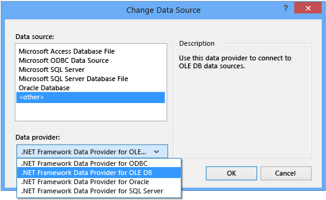
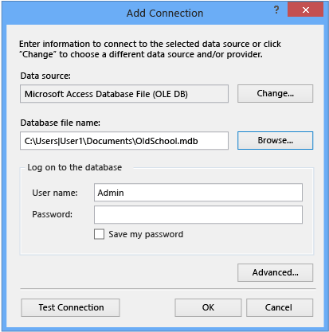

# Connect to data in an Access database (Windows Forms)
[!INCLUDE[vs2017banner](../includes/vs2017banner.md)]

You can connect to an Access database (either an .mdf file or an .accdb file) by using Visual Studio. After you define the connection, the data appears in the **Data Sources** window. From there, you can drag tables or views onto your forms.  
  
## Prerequisites  
 To use these procedures, you need a Windows Forms application project, and either an Access database (.accdb file) or an Access 2000–2003 database (.mdb file). Follow the procedure that corresponds to your file type.  
  
## Creating the dataset for an .accdb file  
 You can connect to databases created through Access 2013, Office 365, Access 2010, or Access 2007 by using the following procedure.  
  
#### To create the dataset  
  
1.  Open the Windows Forms application to which you want to connect data.  
  
2.  On the **View** menu, select **Other Windows** > **Data Sources**.  
  
       
  
3.  In the **Data Sources** window, click **Add New Data Source**.  
  
       
  
4.  Select **Database** on the **Choose a Data Source Type** page, and then select **Next**.  
  
5.  Select **Dataset** on the **Choose a Database Model** page, and then select **Next**.  
  
6.  On the **Choose your Data Connection** page, select **New Connection** to configure a new data connection.  
  
7.  Change the **Data source** to **.NET Framework Data Provider for OLE DB**.  
  
       
  
    > [!IMPORTANT]
    >  Although a data source of **Microsoft Access Database File (OLE DB)** might seem like the right choice, you use that data-source type only for .mdb database files.  
  
8.  In **OLE DB Provider**, select **Microsoft Office 12.0 Access Database Engine OLE DB Provider**.  
  
       
  
9. In **Server or file name**, specify the path and name of the .accdb file to which you want to connect, and then select **OK**.  
  
    > [!NOTE]
    >  If the database file has a user name and password, specify them before you select **OK**.  
  
10. Select **Next** on the **Choose your Data Connection** page.  
  
11. Select **Next** on the **Save connection string to the Application Configuration file** page.  
  
12. Expand the **Tables** node on the **Choose your Database Objects** page.  
  
13. Select whatever tables or views you want in your dataset, and then select **Finish**.  
  
     The dataset is added to your project, and the tables and views appear in the **Data Sources** window.  
  
## Creating the dataset for an .mdb file  
 You create the dataset by running the **Data Source Configuration Wizard**.  
  
#### To create the dataset  
  
1.  Open the Windows Forms application to which you want to connect data.  
  
2.  On the **View** menu, select **Other Windows** > **Data Sources**.  
  
       
  
3.  In the **Data Sources** window, click **Add New Data Source**.  
  
4.  Select **Database** on the **Choose a Data Source Type** page, and then select **Next**.  
  
5.  Select **Dataset** on the **Choose a Database Model** page, and then select **Next**.  
  
6.  On the **Choose your Data Connection** page, select **New Connection** to configure a new data connection.  
  
7.  If the data source is not **Microsoft Access Database File (OLE DB)**, select **Change** to open the **Change Data Source** dialog box and select **Microsoft Access Database File**, and then select **OK**.  
  
8.  In the **Database file name**, specify the path and name of the .mdb file to which you want to connect, and then select **OK**.  
  
       
  
9. Select **Next** on the **Choose your Data Connection** page.  
  
10. Select **Next** on the **Save connection string to the Application Configuration file** page.  
  
11. Expand the **Tables** node on the **Choose your Database Objects** page.  
  
12. Select whatever tables or views you want in your dataset, and then select **Finish**.  
  
     The dataset is added to your project, and the tables and views appear in the **Data Sources** window.  
  
## Security  
 Storing sensitive information (such as a password) can affect the security of your application. Using Windows Authentication (also known as integrated security) is a more secure way to control access to a database. For more information, see [Protecting Connection Information](http://msdn.microsoft.com/library/1471f580-bcd4-4046-bdaf-d2541ecda2f4).  
  
## Next Steps  
 The dataset that you just created is now available in the **Data Sources** window. You can now perform any of the following tasks:  
  
-   Select items in the **Data Sources** window and drag them onto your form (see [Bind Windows Forms controls to data in Visual Studio](../data-tools/bind-windows-forms-controls-to-data-in-visual-studio.md)).  
  
-   Open the data source in the Dataset Designer to add or edit the objects that make up the dataset.  
  
-   Add validation logic to the <xref:System.Data.DataTable.ColumnChanging> or <xref:System.Data.DataTable.RowChanging> event of the data tables in the dataset (see [Validate data in datasets](../data-tools/validate-data-in-datasets.md)).  
  
## See Also

 [Preparing Your Application to Receive Data](http://msdn.microsoft.com/library/c17bdb7e-c234-4f2f-9582-5e55c27356ad)   
 [Bind controls to data in Visual Studio](../data-tools/bind-controls-to-data-in-visual-studio.md)   
 [Validating Data](http://msdn.microsoft.com/library/b3a9ee4e-5d4d-4411-9c56-c811f2b4ee7e)   
 [Data Walkthroughs](http://msdn.microsoft.com/library/15a88fb8-3bee-4962-914d-7a1f8bd40ec4)