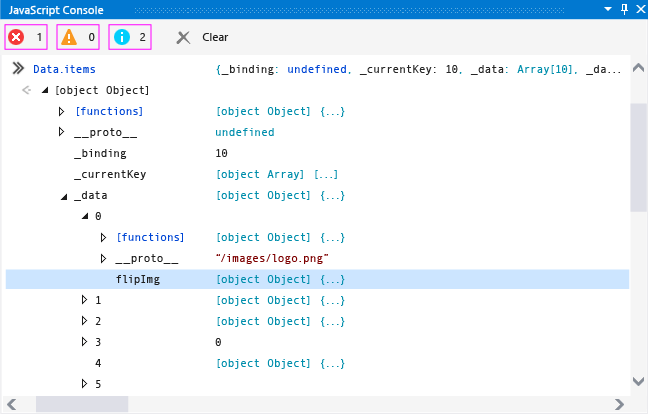
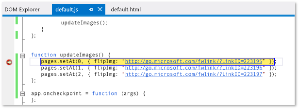
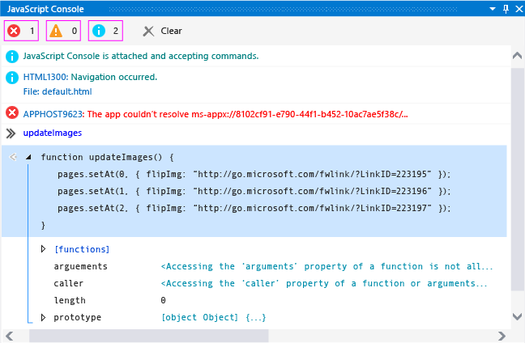

# QuickStart: Debug JavaScript using the console
[!INCLUDE[vs2017banner](../includes/vs2017banner.md)]

Applies to Windows and Windows Phone](../Image/windows_and_phone_content.png "windows_and_phone_content")  
  
 You can use the JavaScript Console window to interact with and debug Store apps built using JavaScript. These features are supported for [!INCLUDE[win8_appname_long](../includes/win8-appname-long-md.md)] apps, Windows Phone Store apps, and apps created using Visual Studio Tools for Apache Cordova. For the console command reference, see [JavaScript Console commands](../debugger/javascript-console-commands.md).  
  
 The JavaScript Console window allows you to:  
  
- Send objects, values, and messages from your app to the console window.  
  
- View and modify the values of local and global variables in the running app.  
  
- View object visualizers.  
  
- Run JavaScript code that executes within the current script context.  
  
- View JavaScript errors and exceptions, in addition to Document Object Model (DOM) and Windows Runtime exceptions.  
  
- Perform other tasks, like clearing the screen. See [JavaScript Console commands](../debugger/javascript-console-commands.md) for the full list of commands.  
  
  In this topic:  
  
- [Debug by using the JavaScript Console window](#InteractiveConsole)  
  
- [Interactive debugging and break mode](#InteractiveDebuggingBreakMode)  
  
- [Single-line mode and multiline mode in the JavaScript Console window](#SinglelineMultilineMode)  
  
- [Switching the script execution context](#Switching)  
  
> [!TIP]
>  If the JavaScript Console window is closed, choose **Debug**>**Windows** > **JavaScript Console** to re-open it. The window appears only during a script debugging session.  
  
 Using the JavaScript Console window, you can interact with your app without stopping and restarting the debugger. For more info, see [Refresh an app (JavaScript)](../debugger/refresh-an-app-javascript.md). For info on other JavaScript debugging features, such as using the DOM Explorer and setting breakpoints, see [Quickstart: Debug HTML and CSS](../debugger/quickstart-debug-html-and-css.md) and [Debug apps in Visual Studio](../debugger/debug-store-apps-in-visual-studio.md).  
  
##  <a name="InteractiveConsole"></a> Debug by using the JavaScript Console window  
 The following steps create a `FlipView` app and show how to interactively debug a JavaScript coding error.  
  
> [!CAUTION]
>  The sample app here is a Windows Store app. However, the console features described here also apply to apps created using Visual Studio Tools for Apache Cordova.  
  
#### To debug JavaScript code in the FlipView app  
  
1.  Create a new solution in Visual Studio by choosing **File** > **New Project**.  
  
2.  Choose **JavaScript** > **Store Apps**, choose either **Windows Apps** or **Windows Phone Apps**, and then choose **Blank App**.  
  
3.  Type a name for the project, such as `FlipViewApp`, and choose **OK** to create the app.  
  
4.  In the BODY element of default.html, replace the existing HTML code with this code:  
  
    ```html  
    <div id="flipTemplate" data-win-control="WinJS.Binding.Template"  
             style="display:none">  
        <div class="fixedItem" >  
              
        </div>  
    </div>  
    <div id="fView" data-win-control="WinJS.UI.FlipView" data-win-options="{  
        itemDataSource: Data.items.dataSource, itemTemplate: flipTemplate }">  
    </div>  
    ```  
  
5.  Open default.css and add the CSS for the `#fView` selector:  
  
    ```css  
    #fView {  
        background-color:#0094ff;  
        height: 500px;  
        margin: 25px;  
    }  
    ```  
  
6.  Open default.js and replace the code with the following JavaScript code:  
  
    ```javascript  
    (function () {  
        "use strict";  
  
        var app = WinJS.Application;  
        var activation = Windows.ApplicationModel.Activation;  
  
        var myData = [];  
        for (var x = 0; x < 4; x++) {  
            myData[x] = { flipImg: "/images/logo.png" }  
        };  
  
        var pages = new WinJS.Binding.List(myData, { proxy: true });  
  
        app.onactivated = function (args) {  
            if (args.detail.kind === activation.ActivationKind.launch) {  
                if (args.detail.previousExecutionState !==  
                activation.ApplicationExecutionState.terminated) {  
                    // TODO: . . .  
                } else {  
                    // TODO: . . .  
                }  
                args.setPromise(WinJS.UI.processAll());  
  
                updateImages();  
            }  
        };  
  
        function updateImages() {  
  
            pages.push(0, { flipImg: "http://go.microsoft.com/fwlink/?LinkID=223195" });  
            pages.push(1, { flipImg: "http://go.microsoft.com/fwlink/?LinkID=223196" });  
            pages.push(2, { flipImg: "http://go.microsoft.com/fwlink/?LinkID=223197" });  
  
        };  
  
        app.oncheckpoint = function (args) {  
        };  
  
        app.start();  
  
        var publicMembers = {  
            items: pages  
        };  
  
        WinJS.Namespace.define("Data", publicMembers);  
  
    })();  
    ```  
  
7.  If a debugging target isn't already selected, choose **Simulator** or, for Windows Phone, **Emulator 8.1 WVGA 4 inch 512MB** from the drop-down list next to the **Device** button on the **Debug** toolbar:  
  
       
  
8.  Press F5 to start the debugger.  
  
     The app runs but images are missing. APPHOST errors in the JavaScript Console window indicate that images are missing.  
  
9. With the `FlipView` app running in the Simulator or the Phone Emulator, type `Data.items` in the console window input prompt (next to the “>>” symbol) and press Enter.  
  
     A visualizer for the `items` object appears in the console window. This indicates that the `items` object instantiated and is available in the current script context. In the console window, you can click through the nodes of an object to view property values (or use the arrow keys). If you click down into the `items._data` object, as you see in this illustration, you'll find that its image source references are incorrect, as expected. The default images (logo.png) are still present in the object, and there are missing images interspersed with the expected images.  
  
       
  
     Also note that there are many more items in `items._data` object than you would expect.  
  
10. At the prompt, type `Data.items.push` and press Enter. The console window shows a visualizer for the `push` function, which is implemented in a [!INCLUDE[winjs_long](../includes/winjs-long-md.md)] project file. In this app, we are using `push` to add the correct items. With a little investigation using IntelliSense, we find out that we should be using `setAt` to replace the default images.  
  
11. To fix this problem interactively without stopping the debugging session, open default.js and select this code from the `updateImages` function:  
  
    ```javascript  
    pages.push(0, { flipImg: "http://go.microsoft.com/fwlink/?LinkID=223195" });  
    pages.push(1, { flipImg: "http://go.microsoft.com/fwlink/?LinkID=223196" });  
    pages.push(2, { flipImg: "http://go.microsoft.com/fwlink/?LinkID=223197" });  
    ```  
  
     Copy and paste this code into the JavaScript Console input prompt.  
  
    > [!TIP]
    >  When you paste multiple lines of code into the JavaScript Console input prompt, the console input prompt automatically switches to multiline mode. You can press Ctrl+Alt+M to turn multiline mode on and off. To run a script in multiline mode, press Ctrl+Enter or choose the arrow symbol in the lower-right corner of the window. For more info, see [Single-line mode and multiline mode in the JavaScript Console window](#SinglelineMultilineMode).  
  
12. Correct the `push` function calls in the prompt, replacing `pages.push` with `Data.items.setAt`. The corrected code should look like this:  
  
    ```javascript  
    Data.items.setAt(0, { flipImg: "http://go.microsoft.com/fwlink/?LinkID=223195" });  
    Data.items.setAt(1, { flipImg: "http://go.microsoft.com/fwlink/?LinkID=223196" });  
    Data.items.setAt(2, { flipImg: "http://go.microsoft.com/fwlink/?LinkID=223197" });  
    ```  
  
    > [!TIP]
    >  If you want to use the `pages` object instead of `Data.items`, you would need to set a breakpoint in your code to keep the `pages` object in scope.  
  
13. Choose the green arrow symbol to run the script.  
  
14. Press Ctrl+Alt+M to switch the console input prompt to single-line mode, and then choose **Clear input** (the red “X”) to delete the code from the input prompt.  
  
15. Type `Data.items.length = 3` at the prompt, and then press Enter. This removes the extraneous elements from the data.  
  
16. Check the Simulator or the Phone Emulator again, and you'll see that the correct images are on the correct `FlipView` pages.  
  
17. In DOM Explorer, you can see the updated DIV element, and you can navigate into the subtree to find the expected IMG elements.  
  
18. Stop debugging by choosing **Debug** > **Stop Debugging** or by pressing Shift+F5, and then fix the source code.  
  
     For the complete default.html page containing corrected sample code, see [Debug HTML, CSS, and JavaScript sample code](../debugger/debug-html-css-and-javascript-sample-code.md).  
  
##  <a name="InteractiveDebuggingBreakMode"></a> Interactive debugging and break mode  
 You can use breakpoints and step into code while you're using JavaScript debugging tools like the JavaScript Console window. When a program that's running in the debugger encounters a breakpoint, the debugger temporarily suspends execution of the program. When execution is suspended, your program switches from run mode to break mode. You can resume execution at any time.  
  
 When a program is in break mode, you can use the JavaScript Console window to run scripts and commands that are valid in the current script execution context. In this procedure, you'll use the fixed version of the `FlipView` app that you created earlier to demonstrate the use of break mode.  
  
#### To set a breakpoint and debug the app  
  
1.  In the default.html file of the `FlipView` app that you previously created, open the shortcut menu for the `updateImages()` function, and then choose **Breakpoint** > **Insert Breakpoint**.  
  
2.  Choose **Local Machine** or **Emulator 8.1 WVGA 4 inch 512MB** in the drop-down list next to the **Start Debugging** button on the **Debug** toolbar.  
  
3.  Choose **Debug** > **Start Debugging**, or press F5.  
  
     The app enters break mode when execution reaches the `updateImages()` function, and the current line of program execution is highlighted in yellow.  
  
       
  
     You can change the values of variables to immediately affect the program state without ending the current debugging session.  
  
4.  Type `updateImages` at the prompt and press Enter. A visualizer for the function appears in the console window.  
  
5.  Select the function in the console window to show the function implementation.  
  
     The following illustration shows the console window at this point.  
  
       
  
6.  Copy one line of the function from the output window to the input prompt, and change the index value to 3:  
  
    ```javascript  
    pages.setAt(3, { flipImg: "http://go.microsoft.com/fwlink/?LinkID=223197" });  
    ```  
  
7.  Press Enter to run the line of code.  
  
     If you want to step through the code line by line, press F11, or press F5 to continue program execution.  
  
8.  Press F5 to continue program execution. The `FlipView` app appears, and now all four pages show one of the non-default images.  
  
     To switch back to Visual Studio, press F12 or Alt+Tab.  
  
##  <a name="SinglelineMultilineMode"></a> Single-line mode and multiline mode in the JavaScript Console window  
 The input prompt for the JavaScript Console window supports both single-line mode and multiline mode. The interactive debugging procedure in this topic provides an example of using both modes. You can press Ctrl+Alt+M to switch between modes.  
  
 Single-line mode provides input history. You can navigate through the input history by using the Up Arrow and Down Arrow keys. Single-line mode clears the input prompt when you run scripts. To run a script in single-line mode, press Enter.  
  
 Multiline mode does not clear the input prompt when you run scripts. When you switch to single-line mode from multiline mode, you can clear the input line by pressing **Clear input** (the red “X”). To run a script in multiline mode, press Ctrl+Enter or choose the arrow symbol in the lower-right corner of the window.  
  
##  <a name="Switching"></a> Switching the script execution context  
 The JavaScript Console window allows you to interact with a single execution context, which represents a single instance of the web platform host (WWAHost.exe), at a time. In some scenarios, your app may start another instance of the host, such as when you use an `iframe`, a share contract, a web worker, or a `WebView` control. If another instance of the host is running, you can select a different execution context while running the app by selecting the execution context in the **Target** list.  
  
 The following illustration shows the Target list in the JavaScript Console window.  
  
   
  
 You can also switch the execution context by using the `cd` command, but you must know the name of the other execution context and the reference you use must be in scope. The **Target** list provides better access to other execution contexts.  
  
##  <a name="BrowserSupport"></a> Browser and Platform Support  
 The JavaScript Console window is supported on the following platforms:  
  
-   [!INCLUDE[win8_appname_long](../includes/win8-appname-long-md.md)] and Windows Phone Store apps using JavaScript and HTML  
  
-   Internet Explorer 11 running on [!INCLUDE[win81](../includes/win81-md.md)]  
  
-   Internet Explorer 10 running on [!INCLUDE[win8](../includes/win8-md.md)]  
  
## See Also  
 [Debug apps in Visual Studio](../debugger/debug-store-apps-in-visual-studio.md)   
 [JavaScript Console commands](../debugger/javascript-console-commands.md)   
 [Refresh an app (JavaScript)](../debugger/refresh-an-app-javascript.md)   
 [Keyboard shortcuts](../debugger/keyboard-shortcuts-html-and-javascript.md)   
 [Debug HTML, CSS, and JavaScript sample code](../debugger/debug-html-css-and-javascript-sample-code.md)   
 [Quickstart: Debug HTML and CSS](../debugger/quickstart-debug-html-and-css.md)   
 [Debug a WebView control](../debugger/debug-a-webview-control.md)   
 [Product Support and Accessibility](http://msdn.microsoft.com/library/tzbxw1af\(VS.120\).aspx)
