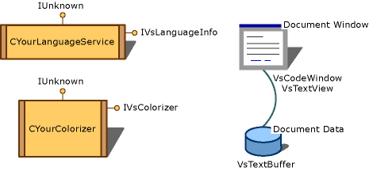

# Model of a Legacy Language Service
[!INCLUDE[vs2017banner](../../includes/vs2017banner.md)]

A language service defines the elements and features for a specific language, and is used to provide the editor with information specific to that language. For example, the editor needs to know the elements and keywords of the language in order to support syntax coloring.  
  
 The language service works closely with the text buffer managed by the editor and the view that contains the editor. The Microsoft IntelliSense **Quick Info** option is an example of a feature provided by a language service.  
  
## A Minimal Language Service  
 The most basic language service contains the following two objects:  
  
- The *language service* implements the <xref:Microsoft.VisualStudio.TextManager.Interop.IVsLanguageInfo> interface. A language service has information about the language, including its name, file name extensions, code window manager, and colorizer.  
  
- The *colorizer* implements the <xref:Microsoft.VisualStudio.TextManager.Interop.IVsColorizer> interface.  
  
  The following conceptual drawing shows a model of a basic language service.  
  
    
  Basic language service model  
  
  The document window hosts the *document view* of the editor, in this case the [!INCLUDE[vsprvs](../../includes/vsprvs-md.md)] core editor. The document view and the text buffer are owned by the editor. These objects work with [!INCLUDE[vsprvs](../../includes/vsprvs-md.md)] through a specialized document window called a *code window*. The code window is contained in an <xref:Microsoft.VisualStudio.Shell.Interop.IVsWindowFrame> object that is created and controlled by the IDE.  
  
  When a file with a given extension is loaded, the editor locates the language service associated with that extension and passes to it the code window by calling the <xref:Microsoft.VisualStudio.TextManager.Interop.IVsLanguageInfo.GetCodeWindowManager%2A> method. The language service returns a *code window manager*, which implements the <xref:Microsoft.VisualStudio.TextManager.Interop.IVsCodeWindowManager> interface.  
  
  The following table provides an overview of the objects in the model.  
  
|Component|Object|Function|  
|---------------|------------|--------------|  
|Text buffer|<xref:Microsoft.VisualStudio.TextManager.Interop.VsTextBuffer>|A Unicode read/write text stream. It is possible for text to use other encodings.|  
|Code window|<xref:Microsoft.VisualStudio.TextManager.Interop.VsCodeWindow>|A document window that contains one or more text views. When [!INCLUDE[vsprvs](../../includes/vsprvs-md.md)] is in multiple-document interface (MDI) mode, the code window is an MDI child.|  
|Text view|<xref:Microsoft.VisualStudio.TextManager.Interop.VsTextView>|A window that lets the user navigate and view text by using the keyboard and mouse. A text view appears to the user as an editor. You can use text views in ordinary editor windows, the Output window, and the Immediate window. Additionally, you can configure one or more text views within a code window.|  
|Text manager|Managed by the <xref:Microsoft.VisualStudio.TextManager.Interop.SVsTextManager> service, from which you obtain an <xref:Microsoft.VisualStudio.TextManager.Interop.IVsTextManager> pointer|A component that maintains common information shared by all the components described previously.|  
|Language service|Implementation dependent; implements <xref:Microsoft.VisualStudio.TextManager.Interop.IVsLanguageInfo>|An object that provides the editor with language-specific information such as syntax highlighting, statement completion, and brace matching.|  
  
## See Also  
 [Document Data and Document View in Custom Editors](../../extensibility/document-data-and-document-view-in-custom-editors.md)
