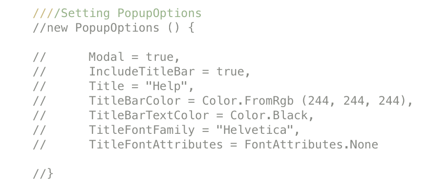

# Comments

When debugging or experimenting with code, it can be useful to comment blocks of code either temporarily or long term.

To comment out an entire block of code:

* Select the code and select **Toggle Line Comment(s)** from the context menu

OR

* Use the `cmd + /` keybinding on the selected code.

These methods can be used to comment and uncomment sections of code. In C# files, additional levels of line comments can be added, which allows regions of codes to be commented and uncommented, while still preserving actual comments:



Comments are also useful for documenting code for future developers that may interact with it. These are usually done in the form of multi-line comments, which are added in the following way in each language:

**C#**

```csharp
/*
 This is a multi-line
 comment in C#
*/
```

**F#**

```fsharp
(*
 This is a multi-line
  comment in F#
*)
```

## See also

- [Comment out code (Visual Studio on Windows)](/visualstudio/ide/quickstart-editor#comment-out-code)