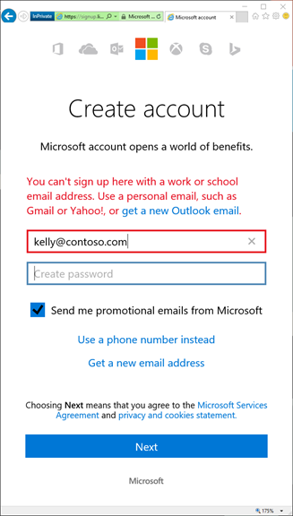
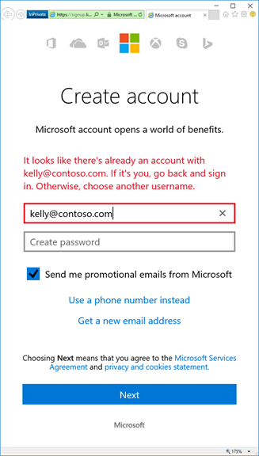

# Issues signing in to Visual Studio subscriptions
To use your Visual Studio subscription, you must first sign in.  Depending on your subscription, you may have set it up with either a Microsoft account (MSA) or an Azure Active Directory (AAD) identity.  This article discusses some of the issues you may encounter while signing in to your subscription.  

## Microsoft Accounts (MSA) cannot be created using work/school email addresses

The ability to create a new personal Microsoft Account (MSA) using a work/school email address is no longer allowed when the email domain is configured in Azure AD. What does this mean? If your organization uses Office 365 or other business services from Microsoft that rely on Azure AD, and if you've added a domain name to your Azure AD tenant, users will no longer be able to create a new personal Microsoft account using an email address in your domain. 

### Why was this change made?

Having a personal Microsoft Account with a work address as a username is fraught with issues for end-users and IT departments alike. For example: 
- Users might think that their personal Microsoft account is business-compliant and that they're in compliance when they save business document to their OneDrive 
- Users who leave an organization generally lose access to their work email address. When they do, they may not be able to back into their personal Microsoft account if they forget their password. The flip side is that their IT department could reset their password and get into the personal account of former employees. 
- IT departments have a false sense of account ownership and security. But users only need to roundtrip a code to their work email address once, and can rename their account at any time in the future. 

The situation is particularly confusing for users who have two accounts with the same email address (one in Azure AD & one Microsoft account). 

### What does this experience look like?

If you try to sign up for a Microsoft consumer app with a work or school email address, you'll see the message below. 

   > [!div class="mx-imgBorder"]
   > 

However, if you try to sign up for a Microsoft app that supports personal and work/school accounts, you should see this message:

   > [!div class="mx-imgBorder"]
   > 

### Are existing accounts affected?
The sign-up block described here only prevents the creation of new accounts. It has no impact on users who already have a Microsoft Account with a work/school email address. If you are already in this situation, we've made making it easier to rename a personal Microsoft account. This [support article](http://windows.microsoft.com/en-US/Windows/rename-personal-microsoft-account) provides simple step-by-step guidance. Renaming your personal Microsoft account means changing the username, and does not impact your work email or how you sign in to business services such as Office 365. It also doesn't impact your personal stuff—it just changes the way you sign in to it. You can use another (personal) email address, get a new @outlook.com email address from Microsoft, or use your phone number as a new username. 

> [!NOTE]
> If your IT department asked you to create a personal Microsoft account with your work/school email, for example to access Microsoft business services like Premier Support, then talk to your admin team before renaming your account. 

## Deleting a sign-in address may prevent access to a subscription

If you delete one or more identities (MSA or AAD) associated with your subscription, your subscriber information including your user name and sign-in ID may be rendered anonymous, resulting in the loss of access to your subscription. 

To avoid impacts to your subscription access, use one of these techniques.  
- Deploy a single identity management system -- either MSA or AAD -- but not both.  
- Associate the AAD and MSA identities via the tenant. 

## Next steps
- Learn how to [link MSA and AAD accounts](/azure/active-directory/b2b/add-users-administrator) within AAD.
- Learn more about [anonymization](anonymization.md). 
